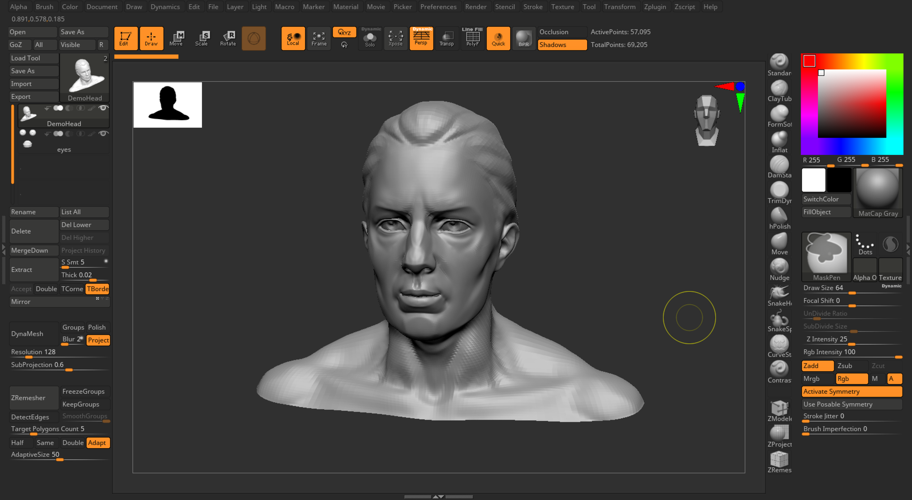

# ZMyCompactUI
My personal ZBrush UI layout, which focuses on speed sculpting.

## Install

1. Go to the [release page](https://github.com/lfod1997/ZMyCompactUI/releases) and download `ZMyCompactUI.cfg` from the latest release
2. Open ZBrush and go to ***Preference -> Config -> Load Ui*** and pick the downloaded .cfg file
3. The UI layout should be loaded. If you like it, go to ***Preference -> Config -> Store Config*** to set it as your ZBrush startup layout

## Notes

This UI layout works with ZBrush 2021 or higher.
